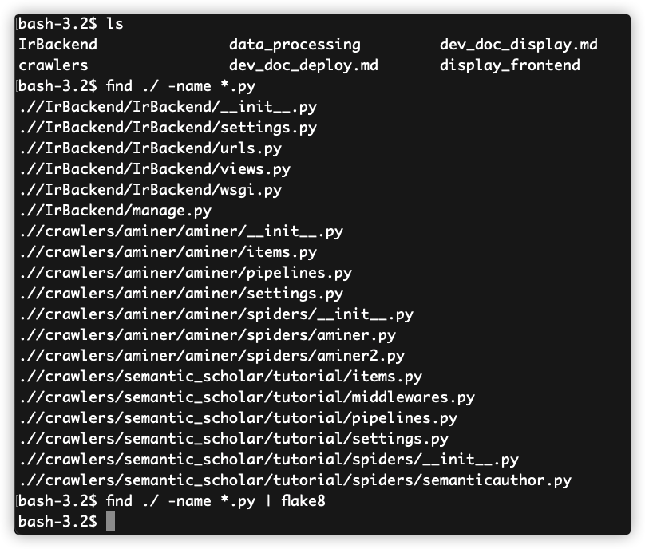

# 1 项目内容
## 1.1 项目题目
学者检索引擎

## 1.2 项目介绍
本项目主要任务是搭建一个学者检索网站，可以通过作者名、论文、机构等信息进行学者检索，并能区分重名作者，合并相同作者（利用机构、著作等信息）。本项目主要包括爬虫模块、检索模块和展示模块三部分。

- 开始界面：
.png)

- 搜索界面：
.png)

## 1.3 项目特色

### 1.3.1 响应式前端设计

本项目前端部分利用Material-UI框架内置的响应式特性，实现网站对客户端设备、屏幕大小的自动适应，具体实现效果为，在浏览器页面宽度较小时，自动执行以下操作：

1. 首页标题自动切换为两行展示；
2. 搜索按钮的图标自动隐藏；
3. 导航栏的标题文字变小，并切换为多行展示；
4. 页面底部的分页组件自动减少展示的页码数量。

除此之外，前端页面的主要特性还包括：

1. 当搜索框内容为空时，用户依然点击搜索按钮或按下<kbd>Enter</kbd>键，页面将会提示用户搜索词不能为空，具体效果将视浏览器而定；
2. 导航栏始终悬浮在页面顶部，其中包括了搜索框组件，便于用户随时搜索；
3. 用户点击分页按钮后，页面将自动滚动至结果列表顶部；
4. 用户访问不存在的路径时，将自动重定向至`Error`页面。

项目致力于为用户打造完善而流畅的用户体验。

# 2 小组成员及分工

|       姓名      | 分工 |
| :-----------: | :----: |
|    张宇航   | 前端 |
|   罗张挥弦  | 后端 |
|    国博凯   | Semantic爬虫 |
|     陈宝    | Aminer爬虫 |
|    林金坤   | 作者合并 |
|    侯嘉璐   | 检索模块 |

# 3 接口
## 3.1 字段定义
- `authorId`: 学者唯一标识符
- `name`: 学者姓名
- `photoUrl`: 头像图片URL
- `academicTitle`: 职称
- `affiliations`: 机构
- `paperCount`: 发表论文总数
- `citationCount`: 被引用总次数
- `hIndex`: h指数
- `coAuthors`: 共同作者列表，对每个元素定义如下字段：
  - `copaperCount`: 共同作者发表共同著作数
  - `authorId`: 共同作者的学者唯一标识符
  - `name`: 共同作者的名称
  - `hIndex`: 共同作者的h指数
- `papers`: 论文信息列表，对每个元素定义如下字段：
  - `paperId`: 论文唯一标识符
  - `title`: 论文题目
  - `year`: 论文发表年份
  - `venue`: 论文发表的会议或期刊杂志
  - `citationCount`: 论文被引数
  - `fieldsOfStudy`: 论文研究领域列表
  - `authors`: 论文作者列表，对每个元素定义如下字段：
	- `authorId`: 作者的学者唯一标识符
	- `name`: 作者的名称

> 考虑到各位学者的论文数量较多，且不同的学者的论文列表有重叠，会造成数据冗余。数据库在存储信息时，对学者和论文分开存储，学者的论文列表只存储论文的ID。当用户请求学者的详情页面，后端将会向论文数据库查询论文具体信息。


## 3.2 前后端接口
### 3.2.1 学者检索API

|          |          Value           |
| :------: | :----------------------: |
|   URL    |      `/api/search`       |
| 请求方式 |          `GET`           |
|   示例   | `/api/search?key=Bengio` |

- 请求参数

| 参数  |   类型   |    说明    |
| :---: | :------: | :--------: |
| `key` | `string` | 搜索关键字 |

- 响应结果

```json
{
	"totalNum": 50,
	"authors":
	[
		{
			"authorId": "1741101",
			"name": "Oren Etzioni",
			"photoUrl": "http://82.156.177.164/image/1741101.jpg",
			"academicTitle": "Professor",
			"affiliations":
			[
				"Allen Institute for AI"
			],
			"paperCount": 10,
			"citationCount": 50,
			"hIndex": 5,
		},
		"...the other 49 items..."
	]
}
```

#### 作者详情API

|          |             Value              |
| :------: | :----------------------------: |
|   URL    |         `/api/author`          |
| 请求方式 |             `GET`              |
|   示例   | `/api/author?authorId=1741101` |

- 请求参数

|    参数    |   类型   |  说明  |
| :--------: | :------: | :----: |
| `authorId` | `string` | 作者ID |

- 响应结果

```json
{
  {
	"authorId": "1741101",
	"name": "Oren Etzioni",
	"photoUrl": "http://82.156.177.164/image/1741101.jpg",
	"academicTitle": "Professor",
	"affiliations": [
	  "Allen Institute for AI"
	],
	"paperCount": 10,
	"citationCount": 50,
	"hIndex": 5,
	"fieldsOfStudy": [
		  "Computer Science"
		],
	"coAuthors": [
		{
			"authorId": "123",
			"name": "Bob",
			"copaperCount": 13,
			"hIndex": 3
		}
	],
	"papers": [
	  {
		"paperId": "649def34f8be52c8b66281af98ae884c09aef38b",
		"url": "https://www.semanticscholar.org/paper/649def34f8be52c8b66281af98ae884c09aef38b",
		"title": "Construction of the Literature Graph in Semantic Scholar",
		"venue": "NAACL",
		"year": 2018,
		"citationCount": 987,
		"fieldsOfStudy": [
		  "Computer Science"
		],
		"authors": [
		  {
			"authorId": "1741101",
			"name": "Oren Etzioni"
		  }
		]
	  }
	]
}
}
```


# 4 模块简介
## 4.1 爬虫模块

爬虫模块基于`scrapy`搭建，使用`mongodb`保存爬取到的数据。

代码结构如下:

```plain
├─crawlers
│  ├─aminer
│  │  │  scrapy.cfg
│  │  │
│  │  └─aminer
│  │      │  items.py
│  │      │  pipelines.py
│  │      │  settings.py
│  │      │  __init__.py
│  │      │
│  │      └─spiders
│  │              aminer.py
│  │              aminer2.py
│  │              __init__.py
│  │
│  └─semantic_scholar
│      │  scrapy.cfg
│      │
│      └─tutorial
│          │  items.py
│          │  middlewares.py
│          │  pipelines.py
│          │  settings.py
│          │
│          └─spiders
│                  semanticauthor.py
│                  __init__.py
│
└─data_processing
        test.ipynb
        test1.ipynb
        test2.ipynb
```

### 4.1.1 Aminer爬虫

aminer爬虫分为两个部分：

1. 第一部分：使用通配符`*`向搜索接口根据h指数从高往低依次进行查询，并逐步添加过滤条件，最终能爬取到350+w作者。
2. 第二部分：利用第一部分爬取到的作者的共同作者和论文的共同作者，得到未爬取过的作者id集合，对这些作者id进行爬取，并更新作者id集合

aminer上共计爬取了1,184,050条作者数据，字段覆盖率如下：

|       字段    |  数量 | 覆盖率（%） |
| :-----------: | :-----: | :----: |
|    authorId   | 1184050 | 100.00 |
|      name     | 1184050 | 100.00 |
|    photoUrl   | 107878  |  9.11  |
| academicTitle | 112663  |  9.52  |
|  affiliations | 1101369 |  93.02 |
|   paperCount  | 1184050 | 100.00 |
| citationCount | 1184050 | 100.00 |
|     hIndex    | 1184050 | 100.00 |
|   coAuthors   | 1183756 |  99.98 |
| fieldsOfStudy |0| 0 |
|     papers    | 1183622 |  99.96 |

aminer上共计爬取了14,855,785篇论文数据，字段覆盖率如下：

|       字段 |  数量   | 覆盖率（%） |
| :-----------: |:----:| :----: |
|     paperId     |14855785|  100 |
|      url      |2284942|  15.38 |
|     title     |14702179|  98.97 |
|     venue     |12684583|  85.38 |
|      year     |14855785| 100.00 |
| citationCount |14855785| 100.00 |
|    authors    |14855784| 100.00 |
|    fieldsOfStudy    |0| 0 |

### 4.1.2 Semantic Scholar 爬虫

因为semantic scholar 的作者id是有规律的整数，我们直接枚举作者id并爬取数据。我们使用了代理ip防止ip被禁，应对semantic scholar对请求速度的限制。

semantic scholar 上共计爬取了70,299条作者数据，字段覆盖率如下：

|       字段   |数量   | 覆盖率（%） |
| :-----------: |:----:| :----: |
|    authorId   |70299| 100.00 |
|      name     |70299| 100.00 |
|    photoUrl   | 0  |  0 |
| academicTitle | 0  |  0  |
|  affiliations |541| 0.77 |
|   paperCount  |70299 |100.00 |
| citationCount |70299| 100.00 |
|     hIndex    | 70299|100.00 |
|   coAuthors   | 68832| 97.91 |
| fieldsOfStudy |69399 | 98.72 |
|     papers    | 69847|99.36 |

semantic scholar 上共计爬取了2,887,389篇论文，字段覆盖率如下：

|       字段 |  数量   | 覆盖率（%） |
| :-----------: |:----:| :----: |
|     paperId     |2887389|  100 |
|      url      |2887389|  100.00 |
|     title     |2887389|  100.00 |
|     venue     |0|  0 |
|      year     |2878381|99.69 |
| citationCount |2887389| 100.00 |
|    authors    |2887389| 100.00 |
|    fieldsOfStudy    |2707645| 93.77 |

## 4.2 检索模块

将mongodb上的作者和论文信息同步到[Elasticsearch](https://www.elastic.co)上进行搜索，有利于提高搜索效率。

Elsaticsearch的配置文件如下：
```yml
node.name: node-1
network.host: 0.0.0.0
http.port: 9200
cluster.initial_master_nodes: ["node-1"]
```
运行
* Window直接点击bin目录下的`elasticsearch.bat`运行。
* Linux在bin目录执行`./elasticsearch`运行

通过访问本地9200端口判断是否运行成功：
```
curl localhost:9200
```
## 4.3 网站模块
### 4.3.1 前端

前端部分使用[React](https://react.docschina.org)框架和[Material-UI](https://mui.com/zh/getting-started/)组件库实现，采用响应式设计方案，代码共计**1498行**（只计算js文件）。

#### 代码结构

```bash
./display_frontend
├── README.md
├── build
├── node_modules
├── package-lock.json
├── package.json
├── public
└── src
    ├── App.css
    ├── App.js
    ├── App.test.js
    ├── assets
    ├── components
    ├── config.js
    ├── index.css
    ├── index.js
    ├── logo.svg
    ├── mocks
    ├── pages
    ├── reportWebVitals.js
    └── setupTests.js
```

`src`存放主要的程序逻辑，其中`index.js`为入口文件，`pages`存放四个主要页面的框架（`Home.js`、`SearchResult.js`、`AuthorProfile.js`、`Error.js`），`components`目录存放上述页面所用到的组件（包括导航栏`NavigationBar.js`、搜索框`SearchBar.js`、作者信息简介`AuthorAbstract.js`等），以便在页面间复用，`mocks`目录用于模拟接口数据；`public`目录存放一些静态资源文件；`build`存放项目打包后生成的文件。

#### 具体实现

- 主页`Home.js`分三栏：标题栏、搜索组件、底部版权栏，其中搜索组件利用React Hook `useState`保存用户输入，用户点击搜索按钮或按下Enter键时，将内容提交至Html表单，参数以`?name=value`方式追加至URL末尾；
- 搜索页`SearchResult.js`包括导航栏、结果列表以及版权栏，导航栏中搜索框的内容由父组件传递，结果列表组件使用`axios`库向后端发起异步请求，将搜索结果保存至内部状态中；
- 作者详细信息页`AuthorProfile.js`包括导航栏、作者简介组件、论文列表组件以及版权栏，同样利用`axios`发起异步请求，其中分页组件通过修改内部数组的起始和结束下标实现分页功能；
- 作者网络关系图组件`NetworkRelationGraph.js`利用了第三方库`echarts-for-react`，在模板图表的基础上进行了大幅修改，其中网络关系的远近以作者共同发表论文数作为评价标准。

### 4.3.2 后端

后端部分采用`Django`框架。`Django`提出MTV模型，在本项目中，由于前后端分离，无需设计Template；由于使用ElasticSearch在PC上执行搜索算法，无需设计Model。因此主要在View设计处理逻辑，并利用requests库向ES获取查询结果。后端执行的操作：
- 为前端提供规范的接口。
- 响应来自前端的请求，构造正确的查询语句，向数据库获取查询结果并返回给前端。
- 处理查询结果中的数据，如计算研究领域、填充缺失的字段

#### 代码结构
`views.py`共**136行**。`urls.py`为路由配置，`wsgi.py`为部署时网页服务器网关设置文件，`settings.py`为`Django`全局配置文件，`views.py`包含了路由规则对应的各个视图函数。

```bash
.
├── IrBackend
│   ├── __init__.py
│   ├── __pycache__
│   │   ├── __init__.cpython-36.pyc
│   │   ├── settings.cpython-36.pyc
│   │   ├── urls.cpython-36.pyc
│   │   ├── views.cpython-36.pyc
│   │   └── wsgi.cpython-36.pyc
│   ├── settings.py
│   ├── urls.py
│   ├── views.py
│   └── wsgi.py
├── manage.py
└── static
    ├── chrismas.jpg
    └── testimg.jpeg
```

# 5 项目部署
## 5.1 数据库
### 5.1.1 依赖项
依赖如下：

  |  依赖项  |  版本  |
  | :------: | :----: |
  |  MongoDB  |  5.0.3  |
  | Elasticsearch | 7.15.1 |
  |  Monstache   | 6.7.7 |
### 5.1.2 配置
配置文件mongo.config如下:
```config
dbpath = D:\apps\mongodb-5.0.3\data
logpath = D:\apps\mongodb-5.0.3\logs\mongo.log
port = 27017
bind_ip = 127.0.0.1
replSet = rs0
```
MongoDB同步到Elasticsearch，同步工具选用[monstache](https://github.com/rwynn/monstache/releases)。monstache配置文件config.toml如下：

```toml
mongo-url = "mongodb://127.0.0.1:27017"
elasticsearch-urls = ["http://localhost:9200"]
elasticsearch-max-conns = 4
      
direct-read-namespaces = ["semantic.author_col"]

change-stream-namespaces = ["semantic.author_col"]
#gzip = true
dropped-collections = true

# propogate dropped databases in MongoDB as index deletes in Elasticsearch
dropped-databases = true

resume = true #从上次同步的时间开始同步
index-as-update = true
verbose = true
[logs]        #日志文件
info = "D:\\IR\\windows-amd64\\info.log"
warn = "D:\\IR\\windows-amd64\\wran.log"
error = "D:\\IR\\windows-amd64\\error.log"
trace = "D:\\IR\\windows-amd64\\trace.log"

[[mapping]]
namespace = "semantic.author_col"
index = "author_col"
```
### 5.1.3 部署运行

执行以下命令启动mongodb：
```
mongodb -f mongo.config
```
按照4.2启动elasticsearch后，启动monstache同步mongodb数据到elasticsearch中，同步命令：
```
monstache.exe -f D:\IR\windows-amd64\config.toml
```
在windows命令行输入`curl localhost:9200/_cat/indices?v`查看是否同步成功。


## 5.2 后端
### 5.2.1 依赖项

主要依赖如下表所示：

  |  依赖项  |  版本  |
  | :------: | :----: |
  |  Django  |  2.12  |
  | requests | 2.26.0 |
  |  nginx   | 1.14.0 |
  |  uwsgi   | 2.0.20 |

### 5.2.2 配置
编辑`uwsgi`配置文件`uwsgi.ini` (set `chdir` to your `IrBackend` project folder):
```bash
irmember@VM-24-13-ubuntu:~$ vim ~/uwsgi.ini 
[uwsgi]

socket = :8888
chdir           = /home/irmember/IrBackend
module          = IrBackend.wsgi
master          = true
processes       = 4
vacuum          = true
```

编辑`nginx`的配置文件:
```bash
# make a backup
irmember@VM-24-13-ubuntu:~$: sudo cp /etc/nginx/sites-available/default /etc/nginx/sites-available/default.bak
irmember@VM-24-13-ubuntu:~$: sudo vim /etc/nginx/sites-available/default

server {
        listen          80;
        server_name     data.scholarsearch.cn
        charset         UTF-8;
        access_log      /var/log/nginx/ssearch_access.log;
        error_log       /var/log/nginx/ssearch_error.log;

        client_max_body_size 75M;

        location /api {

                include uwsgi_params;
                uwsgi_pass 127.0.0.1:8888;
                uwsgi_read_timeout 20;
        }

        location /api/static {

                expires 30d;
                autoindex off;
                add_header Cache-Control private;
                alias /home/irmember/IrBackend/static/;
        }
        # everything else
        location / {
                # serve from frontend build folder
                root   /home/irmember/project2-yyds/display_frontend/build/;
                index  index.html;
                # this is important
                # first try to find files matching url, like css, or js, or favicon
                # if nothing found, serve the index.html            
                try_files $uri /index.html;
        }
}
```

### 5.2.3 部署运行
- 首先确保 `IrBackend` 项目文件夹以及配置文件以及拷贝到目标位置。
- 运行`uWSGI`: `sudo nohup uwsgi --ini uwsgi.ini &`
- 运行`nginx`: `sudo systemctl start nginx`

## 5.3 前端
### 5.3.1 依赖项

主要依赖如下表所示：

  |      依赖项       |  版本   |
  | :---------------: | :-----: |
  |   @mui/material   | 5.1.0  |
  |       react       | 17.0.2 |
  |       axios       | 0.24.0 |
  | echarts-for-react | 3.0.2  |

  详细列表请参见`./display_frontend/package.json`文件。

### 5.3.2 部署运行

  1. 安装`NodeJS`开发环境，本项目需要node版本`>= v16.13.0`，同时使用`npm`管理第三方package；
  2. 在`display_frontend`目录下，执行`npm install`安装依赖，安装完成后执行`npm run build`利用Webpack打包项目，打包结果位于`display_frontend/build`目录中。

# 6 flake8检测结果

